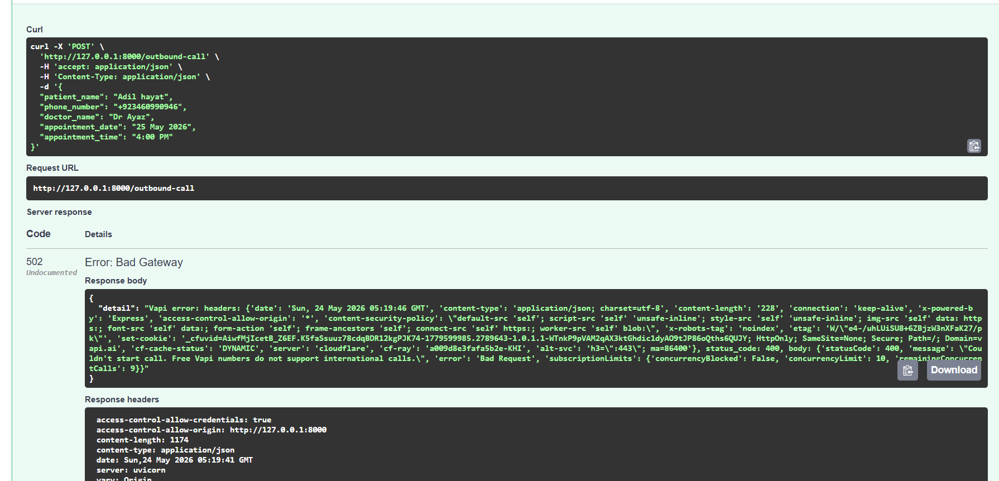
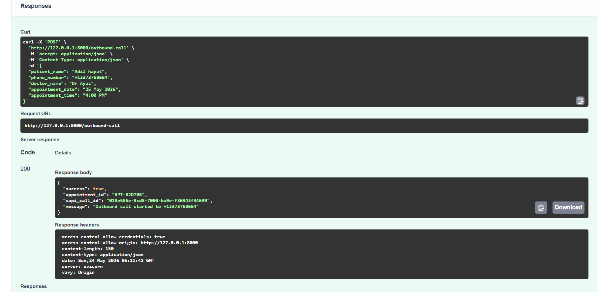

# AI Voice Outbound Appointment Reminder Agent

An AI-powered outbound voice calling system for dental appointment reminders.

This project uses **FastAPI** as the backend and **Vapi AI** for voice calling. The system stores appointment records in a JSON file, starts outbound calls using Vapi, sends patient appointment context to the AI assistant, and updates the appointment record after the call or through Vapi tool calling.

---

## Project Overview

The goal of this project is to automate dental appointment reminder calls.

Clinic staff can enter patient appointment details such as:

- Patient name
- Phone number
- Doctor name
- Appointment date
- Appointment time

The backend saves this appointment data and starts an outbound AI call using Vapi.

During the call, the AI assistant reminds the patient about their appointment and asks whether they want to confirm, cancel, or reschedule.

Based on the patient response, Vapi calls the FastAPI webhook/tool endpoint and the backend updates the appointment status inside `appointments.json`.

---

## Demo Video

Watch the complete project demo here:

[Loom Demo Video](https://www.loom.com/share/5a89990a6be04371a61444dc4d817e46)

---

## Screenshots

### International Call Limitation

During testing, we tried to call an international number. Vapi returned a `400 Bad Request` response because free Vapi phone numbers do not support international outbound calls.

For this reason, the international number test failed.



---

### Successful Outbound Call Using US Demo Number

To test the complete outbound call workflow successfully, we used a US demo number supported by the free Vapi phone number.

The API returned a successful response with:

- `success: true`
- `appointment_id`
- `vapi_call_id`
- outbound call started message



---

## Key Features

- FastAPI backend for appointment and call management
- Vapi AI outbound calling integration
- Patient appointment record creation
- Dynamic patient context sent to the voice assistant
- Vapi tool calling support
- Webhook endpoint for appointment updates
- Call-ended event handling
- Appointment status update in `appointments.json`
- Cloudflare Tunnel support for local webhook testing
- Environment variable based configuration
- Swagger UI testing support through FastAPI docs

---

## Tech Stack

### Backend

- Python
- FastAPI
- Uvicorn
- Pydantic
- Python dotenv
- Requests
- JSON file storage

### AI Voice Platform

- Vapi AI

### Local Public URL

- Cloudflare Tunnel

---

## Folder Structure

```bash
project-root/
│
├── assets/
│   ├── international-call-error.png
│   └── us-number-success.png
│
├── main.py
├── appointments.json
├── requirements.txt
├── .env
├── .gitignore
└── README.md
```

---

## Environment Variables

Create a `.env` file in the project root.

```env
VAPI_API_KEY=your_vapi_private_api_key
ASSISTANT_ID=your_vapi_assistant_id
PHONE_NUMBER_ID=your_vapi_phone_number_id
PUBLIC_BASE_URL=your_cloudflare_tunnel_url
```

Example:

```env
VAPI_API_KEY=your-private-key
ASSISTANT_ID=7e780b71-2019-4978-9f5d-e830e72dcc92
PHONE_NUMBER_ID=your-vapi-phone-number-id
PUBLIC_BASE_URL=https://your-cloudflare-url.trycloudflare.com
```

Important:

- Do not push your real `.env` file to GitHub.
- `VAPI_API_KEY` must stay private.
- `PUBLIC_BASE_URL` must be a public HTTPS URL so Vapi can reach your FastAPI webhook.

---

## Why Cloudflare Tunnel Is Used

The FastAPI backend runs locally on:

```bash
http://127.0.0.1:8000
```

This local URL works only on the developer machine. Vapi servers cannot access `127.0.0.1`.

Vapi needs a public HTTPS URL to call backend endpoints such as:

```bash
/webhook/tool-call
```

Cloudflare Tunnel is used to expose the local FastAPI server to the internet without paid cloud deployment.

We used Cloudflare because:

- We did not have paid cloud hosting for deploying FastAPI
- Vapi requires a public URL for tool calls and webhook events
- Cloudflare Tunnel provides a temporary HTTPS URL for local testing
- It allows Vapi to access the backend while the project is running locally
- It is useful for demos and task submission testing

Example Cloudflare URL:

```bash
https://your-cloudflare-url.trycloudflare.com
```

This URL is added inside Vapi tool/webhook settings so Vapi can call the FastAPI backend.

For production, the backend should be deployed on a permanent server such as Render, Railway, AWS, Azure, or any VPS.

---

## Installation and Setup

### 1. Clone the repository

```bash
git clone your-repository-url
cd your-project-folder
```

### 2. Create virtual environment

```bash
python -m venv venv
```

### 3. Activate virtual environment

For Windows:

```bash
venv\Scripts\activate
```

For macOS/Linux:

```bash
source venv/bin/activate
```

### 4. Install dependencies

```bash
pip install -r requirements.txt
```

### 5. Create `.env` file

Create a `.env` file and add your Vapi credentials.

```env
VAPI_API_KEY=your_vapi_private_api_key
ASSISTANT_ID=your_vapi_assistant_id
PHONE_NUMBER_ID=your_vapi_phone_number_id
PUBLIC_BASE_URL=https://your-cloudflare-url.trycloudflare.com
```

### 6. Run FastAPI server

```bash
uvicorn main:app --reload
```

Backend will run at:

```bash
http://127.0.0.1:8000
```

Swagger API docs will be available at:

```bash
http://127.0.0.1:8000/docs
```

---

## Running Cloudflare Tunnel

Open another terminal and run:

```bash
cloudflared tunnel --url http://127.0.0.1:8000
```

Cloudflare will generate a public HTTPS URL.

Example:

```bash
https://example-name.trycloudflare.com
```

Use this URL as your public backend URL.

Update your `.env`:

```env
PUBLIC_BASE_URL=https://example-name.trycloudflare.com
```

Also add this URL in Vapi tool/webhook configuration.

---

## API Endpoints

### Health Check

```http
GET /
```

Used to confirm that the FastAPI backend is running.

---

### Start Outbound Call

```http
POST /outbound-call
```

This endpoint saves the appointment data and starts an outbound call through Vapi.

Example request:

```json
{
  "patient_name": "Adil Hayat",
  "phone_number": "+1337376864",
  "doctor_name": "Dr Ayaz",
  "appointment_date": "25 May 2026",
  "appointment_time": "4:00 PM"
}
```

Example success response:

```json
{
  "success": true,
  "appointment_id": "APT-827D86",
  "vapi_call_id": "019e58e9-c8c7-700-b9ae-f36943f34699",
  "message": "Outbound call started to +1337376864"
}
```

---

### Vapi Tool/Webhook Endpoint

```http
POST /webhook/tool-call
```

This endpoint is called by Vapi when the assistant uses a tool or when the call event is received.

It is used to update appointment data in `appointments.json`.

Example tool update:

```json
{
  "appointment_id": "APT-827D86",
  "status": "confirmed",
  "notes": "Patient confirmed the appointment"
}
```

Possible statuses:

```bash
pending
confirmed
cancelled
reschedule_requested
completed
call_ended
```

---

### Get Appointments

```http
GET /appointments
```

Returns all appointment records stored in `appointments.json`.

---

## Vapi Assistant Context

When the outbound call starts, patient appointment data is sent to Vapi as dynamic context.

Example context:

```json
{
  "patient_name": "Adil Hayat",
  "doctor_name": "Dr Ayaz",
  "appointment_date": "25 May 2026",
  "appointment_time": "4:00 PM",
  "appointment_id": "APT-827D86"
}
```

The assistant uses this context in the conversation.

Example:

```text
Hello, this is Adil Hayat calling from Maaz Dental Clinic.
Am I speaking with Adil Hayat?
```

Then:

```text
I am calling to remind you about your dental appointment with Dr Ayaz on 25 May 2026 at 4:00 PM.
Are you still able to make it?
```

This makes the conversation context-aware because the assistant does not use hardcoded patient details.

---

## Vapi Tool Calling Flow

The assistant has access to an update appointment tool.

When the patient confirms, cancels, or requests rescheduling, the assistant silently calls the backend tool endpoint.

Example flow:

```text
Patient: Yes, I will come.
Assistant: Calls update_appointment tool.
Backend: Updates appointments.json status to confirmed.
Assistant: Thank you. Your appointment is confirmed.
```

The tool call is silent. The assistant does not tell the patient that it is updating the system.

---

## Call Ended Update Flow

When the call ends, Vapi sends a webhook event to the backend.

The backend receives the event and updates the appointment record in `appointments.json`.

This helps track whether the call was completed, ended, or updated after the conversation.

Example updated appointment record:

```json
{
  "appointment_id": "APT-827D86",
  "patient_name": "Adil Hayat",
  "phone_number": "+1337376864",
  "doctor_name": "Dr Ayaz",
  "appointment_date": "25 May 2026",
  "appointment_time": "4:00 PM",
  "status": "call_ended",
  "vapi_call_id": "019e58e9-c8c7-700-b9ae-f36943f34699"
}
```

---

## Appointment Storage

For this demo project, appointment records are stored in:

```bash
appointments.json
```

This keeps the project simple and easy to test.

The JSON file stores:

- Appointment ID
- Patient name
- Phone number
- Doctor name
- Appointment date
- Appointment time
- Call ID
- Appointment status
- Notes or update details

Example:

```json
[
  {
    "appointment_id": "APT-827D86",
    "patient_name": "Adil Hayat",
    "phone_number": "+1337376864",
    "doctor_name": "Dr Ayaz",
    "appointment_date": "25 May 2026",
    "appointment_time": "4:00 PM",
    "status": "confirmed",
    "vapi_call_id": "019e58e9-c8c7-700-b9ae-f36943f34699",
    "notes": "Patient confirmed the appointment"
  }
]
```

---

## International Call Limitation

During testing, an international phone number was used.

The Vapi API returned a bad request error because the free Vapi phone number does not support international outbound calls.

Error message:

```text
Could not start call. Free Vapi numbers do not support international calls.
```

To test the workflow successfully, a supported US demo number was used.

This allowed the outbound call to start successfully and return a valid `vapi_call_id`.

---

## Testing the Project

### Test 1: Run backend

```bash
uvicorn main:app --reload
```

Open:

```bash
http://127.0.0.1:8000/docs
```

---

### Test 2: Start Cloudflare Tunnel

```bash
cloudflared tunnel --url http://127.0.0.1:8000
```

Copy the generated HTTPS URL and update `.env`.

---

### Test 3: Start outbound call

Use Swagger UI or cURL:

```bash
curl -X 'POST' \
  'http://127.0.0.1:8000/outbound-call' \
  -H 'accept: application/json' \
  -H 'Content-Type: application/json' \
  -d '{
  "patient_name": "Adil Hayat",
  "phone_number": "+1337376864",
  "doctor_name": "Dr Ayaz",
  "appointment_date": "25 May 2026",
  "appointment_time": "4:00 PM"
}'
```

Expected response:

```json
{
  "success": true,
  "appointment_id": "APT-827D86",
  "vapi_call_id": "019e58e9-c8c7-700-b9ae-f36943f34699",
  "message": "Outbound call started to +1337376864"
}
```

---

### Test 4: Check appointment update

After the call or tool call, check:

```bash
appointments.json
```

or call:

```http
GET /appointments
```

The appointment status should be updated based on the conversation.

---

## Conversation Flow

### Step 1: Identity Confirmation

```text
Hello, this is Adil Hayat calling from Maaz Dental Clinic.
Am I speaking with Adil Hayat?
```

### Step 2: Appointment Reminder

```text
I am calling to remind you about your dental appointment with Dr Ayaz on 25 May 2026 at 4:00 PM.
Are you still able to make it?
```

### Step 3: Patient Response

If patient confirms:

```json
{
  "status": "confirmed"
}
```

If patient cancels:

```json
{
  "status": "cancelled"
}
```

If patient wants to reschedule:

```json
{
  "status": "reschedule_requested"
}
```

### Step 4: Backend Update

Vapi calls the FastAPI webhook/tool endpoint.

FastAPI updates the appointment record in:

```bash
appointments.json
```

---

## Design Decisions

### FastAPI Backend

FastAPI was used because it is fast, lightweight, and provides automatic API documentation through Swagger UI.

It also makes it easy to build clean API endpoints for:

- Starting outbound calls
- Handling Vapi tool calls
- Receiving webhook events
- Updating appointment records

---

### JSON File Storage

For the demo version, `appointments.json` is used instead of a database.

This keeps the project simple, easy to run, and easy to review.

The JSON file works like a lightweight table where each appointment record is stored and updated.

---

### Cloudflare Tunnel

Cloudflare Tunnel was used because Vapi needs a public HTTPS endpoint to access the local FastAPI backend.

Since paid cloud deployment was not used, Cloudflare allowed the local backend to be publicly accessible for testing.

This was required for:

- Vapi tool calling
- Webhook events
- Call-ended updates
- Updating appointment JSON from Vapi

---

### Vapi Tool Calling

Vapi tool calling was used so the assistant can update appointment status during the conversation.

This makes the assistant more useful because it does not only talk to the patient; it also updates the backend system.

---

### Context-Aware Conversation

The assistant receives patient-specific data when the call starts.

This allows the AI to use the correct:

- Patient name
- Doctor name
- Appointment date
- Appointment time
- Appointment ID

This avoids hardcoded prompts and makes each call personalized.

---

## GitHub Upload Notes

Before pushing to GitHub, do not upload sensitive or unnecessary files.

Add this to `.gitignore`:

```gitignore
.env
venv/
__pycache__/
*.pyc
node_modules/
.DS_Store
```

Do not expose:

- Vapi private API key
- Real phone number credentials
- Real `.env` file

---

## Project Status

The project includes:

- Working FastAPI backend
- Working outbound call endpoint
- Vapi outbound call integration
- Appointment JSON storage
- Vapi tool calling support
- Call-ended update handling
- Cloudflare Tunnel setup for webhook access
- Demo video and screenshots

---

## Author

Adil Hayat

AI Engineer / Full Stack AI Developer
